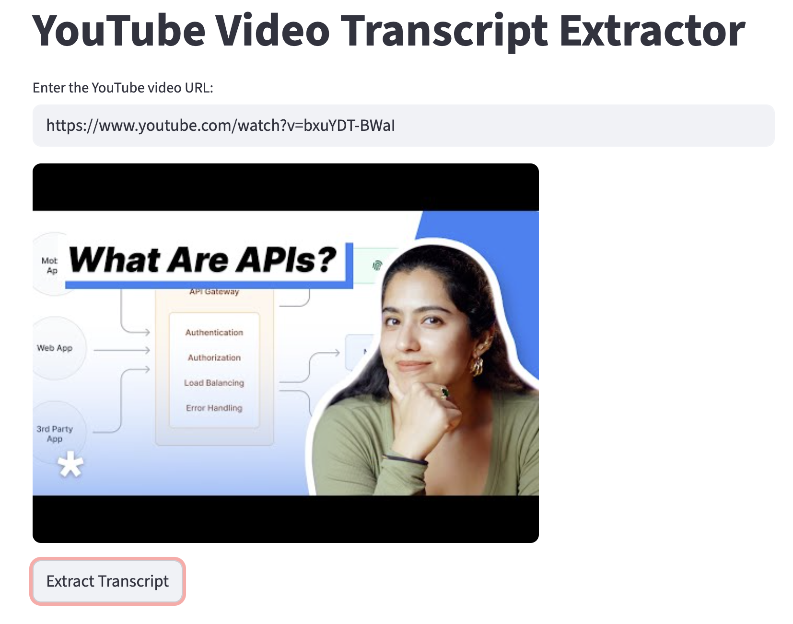
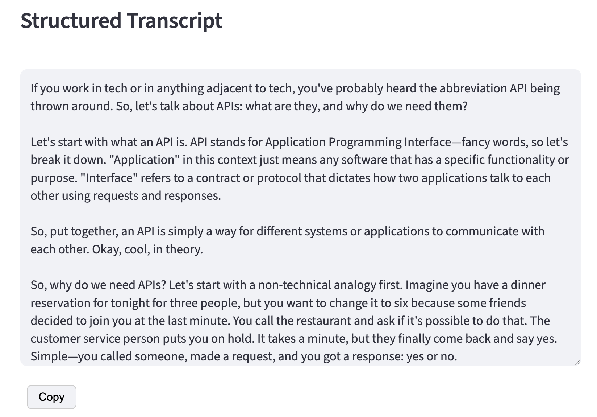
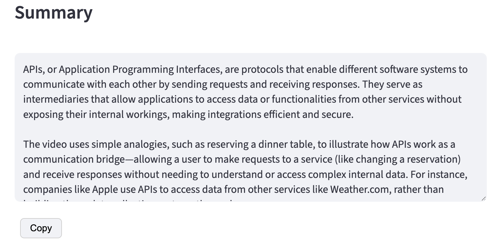

# YouTube Video Transcript Extractor

A Streamlit web app that extracts, structures, and summarizes YouTube video transcripts using AI.

## Features

- **Extract transcript** — fetches the raw transcript from any english YouTube video
- **Structure transcript** — uses GPT-4.1-nano to add punctuation, capitalization, and paragraph breaks to the raw transcript
- **Summarize** — generates a concise summary of the transcript with GPT-4.1-nano
- **Copy button** — one-click copy for both the structured transcript and the summary

## Setup

### 1. Install dependencies

```bash
pip install -r requirements.txt
```

### 2. Configure your OpenAI API key

Create a `.env` file at the root of the project:

```
OPENAI_API_KEY=your_openai_api_key_here
```

### 3. Run the app

```bash
streamlit run app.py
```

## Usage

1. Paste a YouTube video URL into the input field
2. Click **Extract Transcript** — the app fetches and structures the transcript
3. Click **Summarize** to generate a summary
4. Use the **Copy** button under each section to copy the text to clipboard

### Screenshots







## Project Structure

```
.
├── app.py            # Streamlit application
├── main.ipynb        # Notebook for experimentation
├── requirements.txt  # Python dependencies
├── .env              # API key 
└── ReadMe.md
```

## Requirements

- Python 3.13+
- OpenAI API key

Built with ❤️ by [Mamadou KANE](https://www.linkedin.com/in/kanemamadou/)
